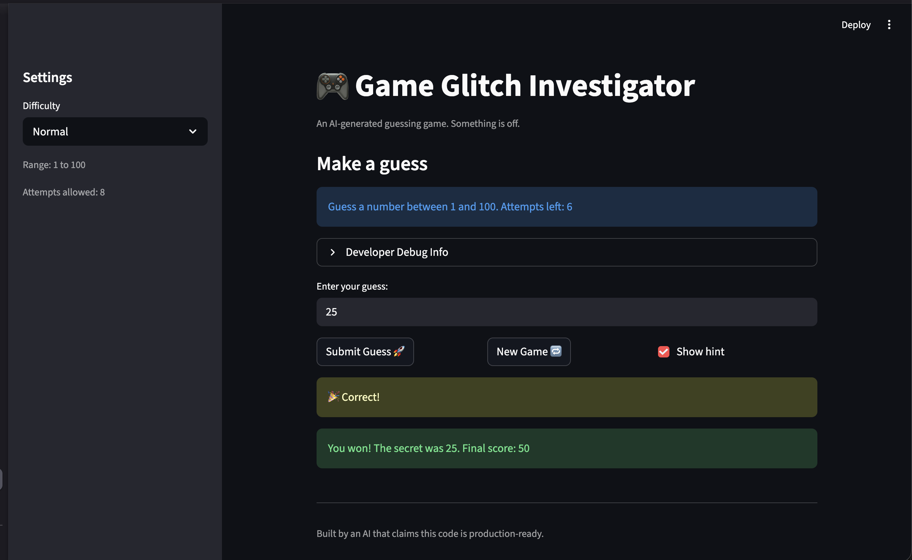

# 🎮 Game Glitch Investigator: The Impossible Guesser

## 🚨 The Situation

You asked an AI to build a simple "Number Guessing Game" using Streamlit.
It wrote the code, ran away, and now the game is unplayable. 

- You can't win.
- The hints lie to you.
- The secret number seems to have commitment issues.

## 🛠️ Setup

1. Install dependencies: `pip install -r requirements.txt`
2. Run the broken app: `python -m streamlit run app.py`

## 🕵️‍♂️ Your Mission

1. **Play the game.** Open the "Developer Debug Info" tab in the app to see the secret number. Try to win.
2. **Find the State Bug.** Why does the secret number change every time you click "Submit"? Ask ChatGPT: *"How do I keep a variable from resetting in Streamlit when I click a button?"*
3. **Fix the Logic.** The hints ("Higher/Lower") are wrong. Fix them.
4. **Refactor & Test.** - Move the logic into `logic_utils.py`.
   - Run `pytest` in your terminal.
   - Keep fixing until all tests pass!

## 📝 Document Your Experience

This is a Streamlit number guessing game where the player picks a difficulty and tries to guess a secret number within a limited number of attempts, guided by "Too High" / "Too Low" hints.

I found and fixed six bugs with the help of Claude Code: the hint directions ("Go HIGHER!" / "Go LOWER!") were swapped; the secret number was alternately cast to a string on even attempts, breaking numeric comparisons; the attempt counter was initialized to 1 instead of 0; the hint UI text hardcoded "1 to 100" regardless of difficulty; the secret wasn't regenerated when difficulty changed mid-session; and "New Game" didn't clear history or reset game status. Claude Code traced each bug, applied the fixes, and generated pytest cases in `tests/test_game_logic.py` to verify them.

## 📸 Demo

## 🚀 Stretch Features

- [ ] [If you choose to complete Challenge 4, insert a screenshot of your Enhanced Game UI here]
